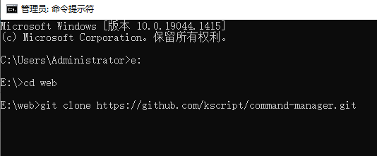
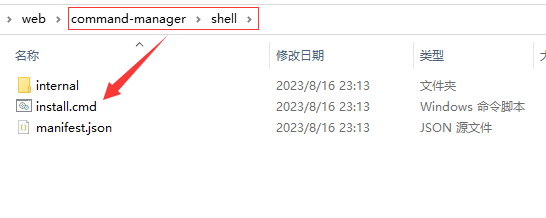
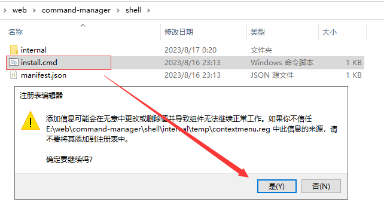
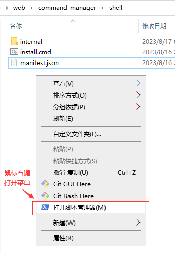
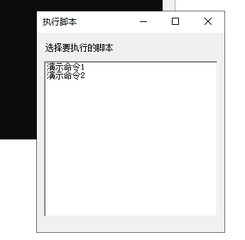
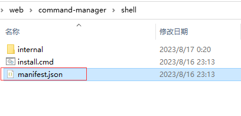

# command-manager

命令管理器，超轻量级的项目命令管理工具，只需在json文件添加少量的配置项，即可在 `Windows资源管理器` 文件区域任意位置即时运行各种命令，让你的项目开发更有 `条理`和 `效率`。

## 运行环境

- Windows系统
- PowerShell （必要）
- nodejs（非必要，用到时有nodejs即可，如果切换版本，则需要再另外配置nvm）
- git （非必要，用到时需在环境变量配置好git-bash.exe路径）

## 使用场景

当手上的项目多起来之后，  
还记得你要运行的项目在什么目录吗？  
还记得你是要运行 `npm run start`、`npm run dev`或者 `npm run serve`吗？  
还记得它们的运行环境是什么样的，node12、node14、node16，git或者其它？  
......
这么多琐碎的重复性工作，为什么不 `做或者找一个工具来管理它们`呢？  
是的，这就是 `命令管理器`的使用场景，让你摆脱琐碎的重复性工作，在Windows资源管理内随时随地，快捷地运行你想要运行的项目。  

## 使用方法

1. clone当前项目  
    

2. 在项目的shell目录下，找到 [install.cmd](./shell/install.cmd) 文件  
    

3. 双击运行[install.cmd](./shell/install.cmd) 文件(用于注册右键菜单)  
    

4. 注册成功后，在Windows资源管理器内点击鼠标右键，选择 `打开脚本管理器`菜单项  
    
5. 选择要执行的脚本 (使用 `鼠标`或 `上下方向键`选择后按 `回车键`)  
    
6. 在shell目录下，找到 [manifest.json](./shell/manifest.json) 文件，根据示例配置项，做相应修改  
    
  如果觉得不直观，可以在当前项目附带的[前端应用](https://kscript.github.io/command-manager/manager)中编辑  
    
